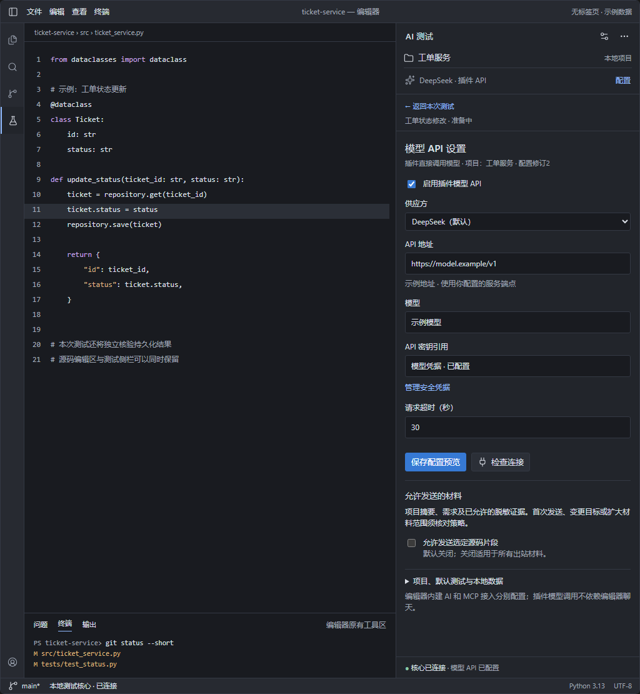
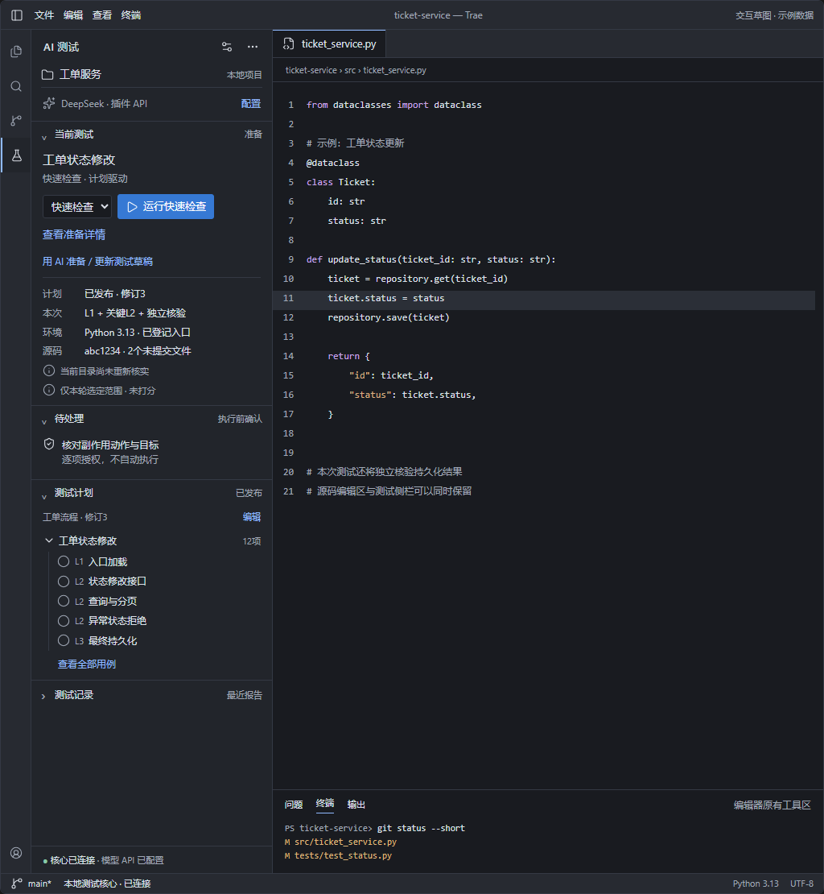
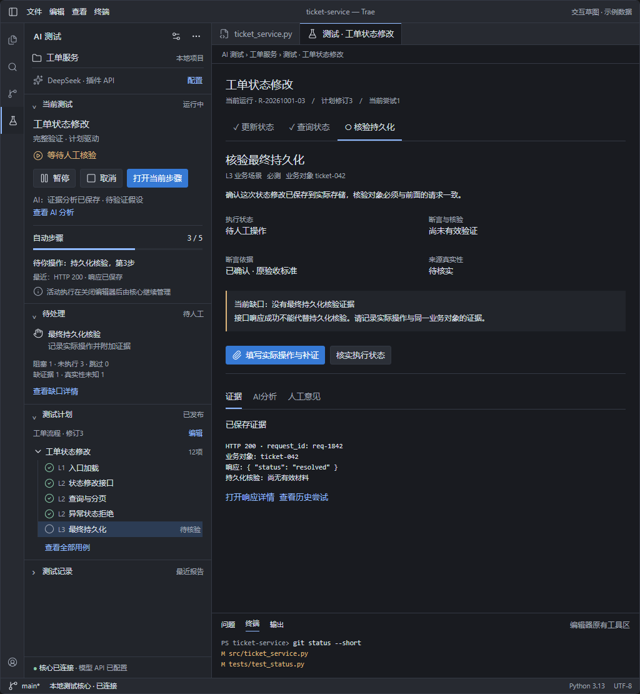
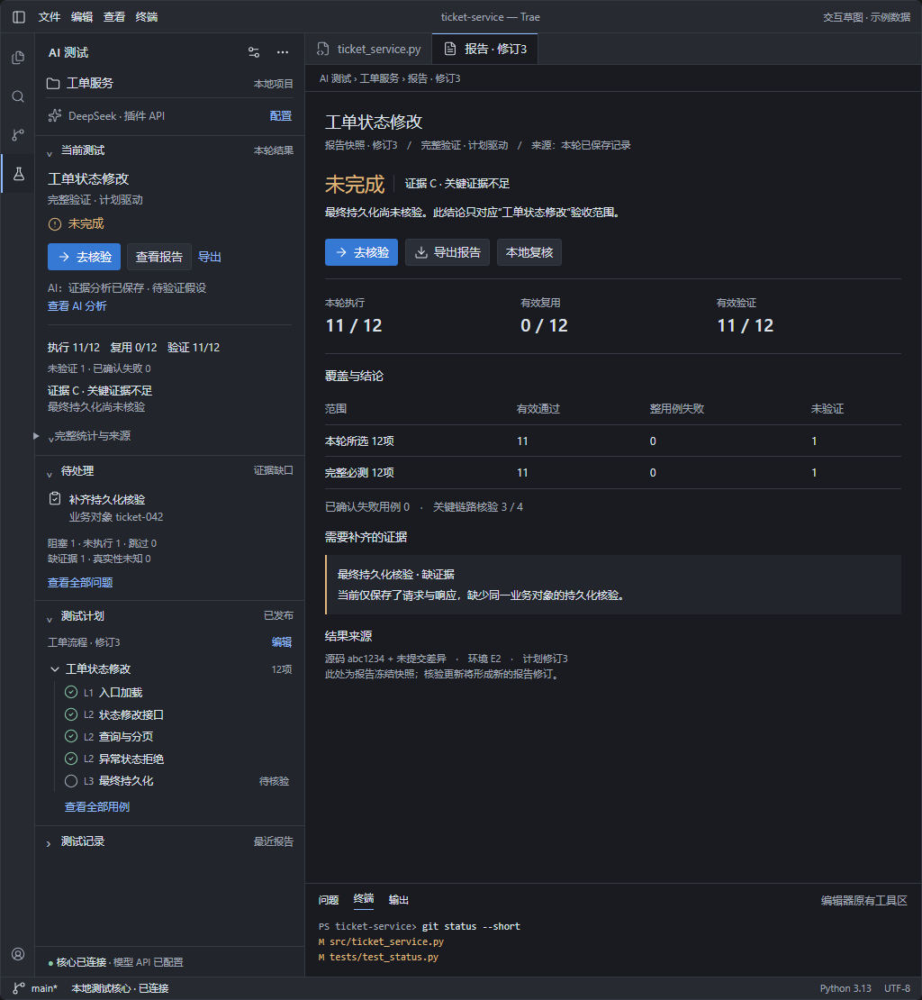

# 编辑器内 AI 辅助测试面板交互设计草案

版本：0.2；日期：2026年10月1日。

状态：界面讨论稿，尚未实现或在真实 Trae 中验证。

范围：一期本地测试闭环；二、三期仅说明扩展位置。

本稿以[一期需求](../需求文档/01-需求文档.md)、[一期功能](../功能文档/01-功能文档.md)、[总体架构](../../总体架构.md)和[面板架构](../架构文档/06-面板与工作台.md)为约束。[原面板设计](01-面板与工作台.md)作为内容与交互参考，不沿用其五个主导航页签。业务字段、判定、确认、存储和恢复语义引用主责合同，不在本稿重新定义。

**推荐方案：一个常驻 AI 测试面板，使用设置中配置的模型 API 准备测试与分析证据。面板回答“让 AI 测什么、现在怎样、下一步做什么”；详情承担计划确认、执行、证据核对和报告阅读。详情默认可在同一面板中切换，宿主支持时也可打开编辑器详情标签页。**

本轮补充突出既有模型能力及宿主容器适配，不增加功能范围。配置与任务语义以[功能文档的 AI 模型接口](../功能文档/01-功能文档.md#ai-模型接口)和[项目与计划架构](../架构文档/01-项目与计划.md#9-复用回归与模型任务矩阵)为准。编辑器内建 AI 与 MCP 是可选接入方式；插件直接调用所配模型 API 的流程不依赖宿主聊天或标签页。

## 1 使用场景与设计目标

使用者通常正在阅读或修改代码。测试面板需要与源码、终端和用户其他工具共存，打开后仍能继续写代码。主要路径是填写测试目标，由插件调用已配置模型准备检查内容及用例草稿，用户核对发布后执行，再由模型分析已保存证据。

| 场景 | 面板应直接提供的帮助 |
| --- | --- |
| 希望 AI 根据项目与需求准备测试 | 输入本次目标，查看允许发送材料及来源，生成并审阅计划草稿 |
| 写完一段代码，想确认是否可运行 | 看清检查范围，发起快速检查，发现问题后进入证据详情 |
| 需要验证一个接口或业务环节 | 选择已发布计划中的用例，运行所选检查，明确本次未覆盖的范围 |
| 正式提测 | 确认验收范围、计划与动作授权，执行完整验证，查看缺口和报告 |
| 执行卡住或需要人工参与 | 清楚显示准确步骤、原因与下一步，在原运行中继续处理 |
| 修改后复测 | 看见修复版本与回归入口，用新执行证据核对问题关闭条件 |
| 回查先前结果 | 打开精确报告修订与证据，始终知道自己正在看历史 |

设计取舍：

- 高频操作围绕当前项目和当前运行组织；配置、模板、规则等按需展开。
- 正文采用紧凑行、树和分隔线；状态、范围与下一步优先于装饰。
- 侧栏保持一个主要动作。运行期间无需切页寻找人工待办或阻塞原因。
- 长文本、复杂表单、日志和报告进入详情；同面板与可选编辑器标签页使用相同内容组件，保留源码工作区。
- AI 生成内容、真实执行、业务结论分别显示；模型输出不能自行发布计划、授权副作用或替代实际证据。
- Webview 是宿主内的实现容器，交互采用编辑器工具面板的尺度：继承主题、字体、焦点与停靠习惯。

## 2 在编辑器中的位置

### 2.1 空间分工

| 宿主区域 | 内容 | 默认行为 |
| --- | --- | --- |
| 测试停靠面板 | 当前测试摘要、AI 准备动作、待处理事项、计划用例树、最近报告 | 用户打开后常驻，可折叠和调整宽度；可在同容器切换详情 |
| 同面板详情 | 计划编辑、测试工作台、证据、问题、报告、插件设置 | 不要求宿主提供标签页；面板内显示对象标题和返回路径 |
| 可选编辑器标签页 | 与同面板详情共享内容 | 有对应能力时由用户打开；标题说明对象和当前/历史身份 |
| 宿主输出区域 | 插件连接与诊断信息 | 仅在排障时打开；业务证据仍在工作台按引用读取 |
| 宿主命令入口 | 打开测试面板、创建计划、打开报告、打开设置 | 使用宿主可用的命令机制，不强占常用编辑快捷键 |

面板使用宿主可提供的停靠位置，主侧栏或另一侧工具面板均可；用户可按宿主能力移动。打开面板不自动关闭资源管理器、终端或其他工具，不强制改变用户停靠布局。

有标签页时，同类详情默认复用一个标签页，用户明确保留的标签页保持原对象与修订。切换对象前保留未保存草稿并提示处理，不用新事件覆盖正在编辑的内容。同面板详情提供“返回本次测试”，恢复原项目、用例选择、展开状态和滚动位置；正在执行的核心任务继续按原状态推进。

### 2.2 宿主能力边界

上述停靠、活动栏图标、命令选择器和输出区域是设计目标，必须在选定 Trae 发行版与版本验证。现有[Trae 接入说明](../../../../integrations/trae/README.md)及扩展骨架只描述候选 VSIX 接口，尚无真实安装兼容证明。

是否具备源码标签页、扩展详情标签页和停靠面板是不同能力，分别检测。没有详情标签页时，在停靠面板内部使用“本次测试 → 用例/报告/设置”的层级切换，详情顶部保留项目、范围、运行状态及返回动作；长表单纵向分节，用例与步骤用目录入口进入。关闭详情只改变视图，不暂停运行。宿主允许时可拉宽或切换到底部停靠；不能依赖该能力才能完成授权与证据阅读。

若只有一个 Webview 容器，也复用同样的概览与详情路径。若没有可承载插件界面的区域，应准确报告面板能力缺失；CLI 可承载已有核心操作，但不能替代真实面板交付。各容器共享面板源码、DTO 与应用用例，不复制业务状态机。真实宿主的容器、焦点、缩放和生命周期仍需实测。

无标签页布局示意：源码保留在原区域，停靠面板显示“AI 测试 / 本次测试”或“返回本次测试 / 最终持久化核验”；计划、报告与设置在该面板内切换，不另开外部窗口。

```text
编辑器窗口
┌────────────┬────────────────────────────┬──────────────┐
│ AI 测试侧栏 │ 源码 / 测试详情标签页        │ 编辑器 AI     │
│            │                            │ （按用户布局）│
│ 当前测试    │ order_service.py           │              │
│ 待处理      │ 测试 · 工单状态修改         │              │
│ 测试计划    │ 报告 · 工单状态修改 · 修订3 │              │
│ 测试记录    │                            │              │
├────────────┴────────────────────────────┴──────────────┤
│ 宿主终端 / 输出（按用户布局）                           │
└───────────────────────────────────────────────────────┘
```

此图只表达有标签页时的空间关系，不要求同时打开所有详情或固定三栏；右侧编辑器 AI 不是插件模型调用的前提。

### 2.3 界面参考图

以下四张图来自本稿对应的交互草图，均为示例数据，不是真实宿主安装或测试执行截图。图片随文档保存在同目录的“界面图”文件夹中。

**图1：无标签页 · 模型 API 设置。** 源码保留在原编辑区，设置在停靠面板内打开；提供供应方、API 地址、模型、密钥引用、超时和连接检查，并可返回本次测试。对应第2、8节。



**图2：准备检查。** 侧栏显示当前范围、档位、准备信息、AI 草稿入口和计划树，与源码编辑区并存。对应第3、4.1、5节。



**图3：运行与工作台。** 侧栏保留当前运行和待人工事项，详情展示最终持久化核验、执行与断言状态、证据及 AI 分析入口。对应第4.2、6节。



**图4：结果与报告。** 分别展示业务结论、证据等级、执行/复用/验证统计及未完成原因；报告保持具体修订的快照身份。对应第4.3、7节。



## 3 侧栏结构：一个入口，四个分组

标题为“AI 测试”。标题工具栏提供“设置”和“更多”，图标有文字提示及可访问名称。下方是当前项目选择器，始终可见；多目录工作区由用户明确选择绑定，不以当前源码标签页静默切换测试项目。

项目下方显示一行模型状态，例如“DeepSeek · 插件 API · 已配置”，可进入模型设置。连接检查成功仅说明该检查时刻的连通性，不能显示为永久可用。未配置时显示“配置模型 API”，模型调用失败则显示具体请求状态；不把编辑器内建 AI 的登录或可用状态当作插件模型状态。

侧栏不设置全宽横向主导航，内容分为四个可折叠分组：

| 分组 | 默认展开 | 内容与用途 |
| --- | --- | --- |
| 当前测试 | 是 | 测试目标、AI 准备入口、范围、档位、驱动、当前阶段、结论/进度及独立动作区 |
| 待处理 | 有内容时 | 待授权、待人工、待核实、阻塞、证据缺口与相关问题入口 |
| 测试计划 | 首次或准备时 | 当前计划及用例树；创建、编辑、按需选择和发布入口 |
| 测试记录 | 否 | 当前项目最近报告摘要、修订展开及完整报告列表入口 |

当前测试折叠时，标题行仍保留范围简称与状态；展开后读取原状态。其他分组的展开选择属于界面状态，不改变业务记录。

```text
AI 测试                                设置  更多
工单系统 ▾
───────────────────────────────────────────────
▾ 当前测试
  工单状态修改
  完整验证 · 计划驱动
  未完成：最终持久化尚未核验
  [去核验]  [查看报告]  更多 ▾       ← 独立动作区
  ──────────────────────────────────
  执行 11/12 · 复用 0/12 · 验证 11/12
  未验证 1 · 已确认失败 0
  证据 C · 关键证据不足
  ▸ 完整统计与来源

▾ 待处理
  待人工      最终持久化核验
  阻塞        1
  未执行 1 · 跳过 0 · 缺证据 1 · 真实性未知 0
  [打开待处理详情]                   ← 动作区

▸ 测试计划    工单流程 · 已发布
▸ 测试记录    最近报告
───────────────────────────────────────────────
核心已连接 · 本地目录模式
```

线框数值为说明信息层级的示例，未作为产品证据。缺口分类可能重叠，不求和为“待办总数”；实现时所有计数均读取核心 DTO，并以同一来源的夹具验证。

### 3.1 当前测试与计划选择

- 无已发布计划时，在动作区填写本次目标，以“AI 准备测试”作为主动作；先检查模型配置和出站策略，生成内容进入草稿审阅，展示缺口与来源，再由用户发布。已有计划时保留运行主动作，AI 更新草稿放在准备详情中，不能覆盖冻结计划。
- 准备详情显示当前 AI 任务及生成记录，例如项目摘要、检查与用例草稿；运行及报告详情可发起指定证据分析。任务状态读取应用用例记录，不用模型“正在思考”动画替代实际执行进度。
- 当前测试关联明确的计划、验收范围和运行。切换计划不会把仍活动的运行替换成新计划结果。
- 有活动运行时，“当前测试”保持该运行；准备另一份计划进入详情，不隐含新开运行或取消原运行。
- 准备阶段的动作区提供档位选择：快速检查、所选检查、完整验证。驱动默认显示为计划驱动，可在准备详情中修改。
- 三种档位共享一个主按钮，文字分别为“运行快速检查”“运行所选检查”“运行完整验证”。
- 快速检查的选择由已发布规则确定。按需在计划树明确选择；完整验证展示必测锁定标记，不提供取消必测勾选。
- 主动作及阻塞原因消费核心返回的可用动作与原因，不由页面猜测门禁。

### 3.2 待处理不是另一套业务记录

待处理分组是 Run/Step/Attempt、DecisionDTO 缺口及问题查询结果的导航投影。每条保留所属运行、步骤/尝试或问题引用；不新增统一待办状态机，也不把确认、人工执行、问题关闭合成一个“完成待办”按钮。

条目显示“类型 + 原因 + 对象”。按钮或可聚焦的导航行进入准确详情，实际授权、执行、核验和处置在详情动作区完成。当前测试的只读信息区只呈现事实，开始、控制、导出和跳转在独立动作区。

### 3.3 测试计划树

一级按已发布的业务目标/范围组织，二级为用例，选中用例后在工作台查看步骤。L1/L2/L3、必测、人工、真实性和证据状态使用简短文字，不全靠图标。

```text
▾ 测试计划                     编辑  新建
  工单流程 · 修订3 · 已发布
  ▾ 工单状态修改
    ✓ L1 入口加载        已验证通过
    ✓ L2 状态接口        已验证通过
    ○ L3 最终持久化      待核验 · 必测
  ▸ 查询与分页
```

“✓”仅用于对应维度已满足的状态；“执行完成、尚未有效验证”显示为文字，不使用通过图标。用例与步骤分别统计，Step 的 Attempt 历史只在详情展开。

运行时仅对核心允许的尚未执行步骤开放修订。正在执行的步骤只读，拒绝理由就地显示。树中查看旧结果必须标为历史，不能把旧通过作为当前状态。

## 4 当前测试的三个阶段

三个阶段占用同一位置，由核心已提交状态切换，保持用户对信息位置的记忆。

### 4.1 准备阶段

信息顺序：范围 → 档位与驱动 → 计划与实际所需环境 → 最近源码事实 → 未就绪原因。无需在主视图列出全部技术编号、规则版本或配置修订；完整追溯放在详情。

```text
▾ 当前测试
  范围：工单状态修改
  快速检查 · 计划驱动
  [快速检查 ▾]  [运行快速检查]
  [查看准备详情]
  ──────────────────────────────────
  计划：工单流程 · 已发布
  本次：适用 L1 + 关键 L2 + 独立核验
  环境：Python 3.13 · 已登记入口
  最近固定源码：abc1234 + 未提交差异
  当前目录尚未重新核实
  待授权：2项；准备后逐项确认
  结论范围：本轮检查，不作完整验收结论
```

plain 目录以文件清单摘要替代源码行中的 Git 内容，整块省略仓库、分支、提交与远端字段。最近快照不等于当前编辑器/磁盘内容。打开面板不扫描源码；分析选定内容和运行准备均由明确动作发起。

计划未发布时主动作改为“完善并发布计划”；必需输入缺失时说明具体字段并提供详情入口。未配置模型不阻止人工计划，无关的数据库、平台账号和远端连接不要求填入。

### 4.2 执行阶段

```text
▾ 当前测试
  工单状态修改 · 完整验证
  正在执行 · 计划驱动
  [暂停]  [取消]  [打开当前步骤]
  ──────────────────────────────────
  自动步骤 3/5
  待你操作：最终持久化核验，第3步
  阻塞 1 · 未执行 3 · 跳过 0
  缺证据 1 · 真实性未知 1
  最近输出：请求已受理，持久化尚未核验
  活动执行在关闭编辑器后继续由核心管理
```

自动进度只表示自动步骤；人工操作显示明确的等待步骤，不模拟进度条。最近输出仅一条安全摘要，完整捕获流在工作台按需读取。持久提交前的材料不计入完成。

| 当前状态 | 动作与反馈 |
| --- | --- |
| 执行中 | 请求暂停、取消，或打开当前步骤 |
| 暂停中 | 显示请求已登记、等待步骤边界；不能写“已暂停” |
| 已暂停 | 恢复、取消，或修订允许的未执行步骤；恢复核对修订与授权 |
| 待授权 | 打开该动作确认；原有效授权不机械重问 |
| 待人工 | 打开当前步骤，填写操作事实与补证 |
| 取消中/待核实 | 打开停止状态与原执行核实；不提供直接重复副作用快捷动作 |

进入工作台后侧栏仍显示整体运行状态。事件更新不自动切走用户正在查看的历史、证据或问题。

### 4.3 结果阶段

展示顺序固定为范围及业务结果 → 下一步动作 → 执行/复用/有效验证 → 证据等级与缺口 → 来源详情。

- 快速/按需通过写“本轮所选检查通过”，同时显示“未打分”和完整必测的验证情况，不称完整验收通过。
- full 结果使用“通过、失败、未完成、不适用”，只对明确的冻结验收范围成立。
- full 等级采用“A 证据充分 / B 局部不足 / C 关键证据不足 / D 无有效依据”，与业务结果分列。
- 当前有效决定性失败存在时主结论显示失败，仍保留后续未完成和阻塞范围。
- 重跑生成新意图与新运行，旧结果保留。新尝试不得回退旧复用绿灯。

“完整统计与来源”展开后分别显示本轮所选与完整必测两个摘要：执行、复用、有效验证、有效通过、整用例已验证失败、未验证及已确认失败用例；读取 CoverageDTO，不从步骤数推算。已确认失败与整用例失败可能重叠，不相加。零分母显示“不适用/无适用项”，缺字段显示“未知”。

必须用以下反例核对布局与文案，具体判定仍由[一期功能第3、14、15节](../功能文档/01-功能文档.md)负责：

| 核心事实 | 用户看到的重点 |
| --- | --- |
| full，12项均执行，2项只缺依据确认，其余有效通过 | 未完成；执行12/12、验证10/12、未验证2；只有该缺口时 B |
| full，12项充分有效核验，1项断言失败 | 失败；验证12/12；A 证据充分；不能用绿色A级盖过失败 |
| 单用例前步有效失败、后步阻塞 | 失败并列阻塞；已确认失败1、整用例验证0、未验证1 |
| 按需选择3项均有效通过，冻结必测12项且其余未验证 | 本轮所选通过3/3；未打分；完整必测验证3/12，未验证9 |
| full，12项均合法整用例复用，无本轮新尝试 | 本轮执行0/12、有效复用12/12、有效验证12/12；展开复用来源；通过仍核对全部full门禁 |
| 全无适用检查 | 不适用；不显示100%或虚构等级 |

## 5 计划编辑：编辑器内的结构化文档

从计划分组“新建/编辑”、准备详情或命令入口打开。标题“计划 · 工单流程”，顶部标明草稿/已发布与具体修订。

内容按以下顺序纵向组织；宽度足够时左侧提供用例目录，正文不再套一层管理后台导航：

1. **目标与范围**：业务目标、模块、依赖闭包、排除及理由、验收条目。
2. **准备材料**：项目上下文与任务交付；明确区分开发自述和实际测试验证。
3. **检查内容**：默认突出模型生成草稿，显示所选模板、允许材料与具体输入来源；同时提供人工编辑/导入及缺项说明。
4. **用例详情**：层级、前置、输入、步骤、预期、断言依据、独立核验、允许 Mock、必测和关键链路关联。
5. **发布核对**：范围摘要、未覆盖项、必测映射与门禁。

动作栏提供“保存草稿”和“确认发布计划”。模型生成结果保留来源标签，先写草稿，不覆盖用户已编辑内容或自动运行。无模板时允许自建/导入；不支持的能力显示未支持，不能冒充不适用。

计划发布、断言依据确认和实际执行授权分开呈现。已发布且依据已填未确认的用例可以按合同执行，但不计有效验证；补确认针对准确依据修订，不修改冻结计划和旧报告。

准备运行时先展示核心冻结的动作摘要，再逐项授权。界面列出实际目标、已解析输入、影响、凭据用途和相关修订；未知变量标待解析。每项确认由受控用户交互提交，不设“一次永久信任全部”。尚无 Run 时确认绑定准备意图及计划步骤，不伪造运行编号。

副作用确认使用足够宽的编辑器内确认视图或宿主受控交互，不把关键目标截断在窄侧栏。返回只保留准备内容，不授权或执行。

## 6 测试工作台与证据详情

从计划树、当前步骤、待处理事项打开“测试 · 范围名称”。单击导航选择对象；选择用例不会隐含执行。

```text
测试 · 工单状态修改                         当前运行
运行 / 计划修订 / 所选步骤 / 当前尝试
─────────────────────────────────────────────────────
步骤列表       │ 最终持久化核验
1 更新状态     │ 目的、前置、实际对象、输入与预期
2 查询状态     │ 执行状态   断言状态   真实性   核验状态
3 核验持久化   │ [继续当前步骤] [附加证据] [核实状态]
               │ ───────────────────────────────────
历史尝试 ▾     │ 证据 | AI分析 | 人工意见
               │ 当前材料、缺口和准确来源引用
─────────────────────────────────────────────────────
当前测试继续按核心状态更新；所选历史内容保持原修订
```

宽视图提供步骤目录与详情两栏；窄视图使用“步骤列表 → 步骤详情 → 返回步骤”的层级，保留选择。主区只有一个滚动容器，日志块可以独立滚动。

| 内容 | 交互要求 |
| --- | --- |
| 执行事实 | 实际命令/请求/操作、已解析输入、开始/终止及保存状态；凭据只显示引用与用途 |
| 证据 | 按类型、来源与业务对象列出安全捕获流、响应、日志和附件；缺失/损坏显示原因与影响范围 |
| AI 分析 | 调用插件所配模型分析指定证据；显示供应方/模型配置修订、请求关联、输入来源和分析缺口；标明待验证假设，与断言结果分开；可驳回留痕 |
| 人工意见 | 保存操作者意见与来源；不替代独立核验或关闭条件 |
| 手工补证 | 绑定步骤/尝试，填写实际操作、采集来源、业务对象、附件与说明；缺项登记原因 |
| 外部结果导入 | 展示来源、结构校验及可关联范围；导入不是默认真实通过 |
| 重试与退回 | 操作前展示受影响下游及需重跑范围；新副作用尝试重新授权 |

“查询原执行结果”“恢复原请求传输”和“重新执行步骤”使用不同动作文字。未知副作用先核实，不能统一给“重试”按钮。替换上游 Attempt 后，依赖旧输出的下游当前依据立即标过期；旧材料仍在历史中可查。

一期位置仅展示可靠已有来源文字或证据引用，不承诺源码自动跳转。二期再增加“打开执行快照”和“校验并打开当前文件”，沿用六态合同；dirty 文档不自动保存、不显示当前已核实。

## 7 报告、问题与测试记录

### 7.1 侧栏只放摘要

“测试记录”默认按当前项目列最近报告摘要；每行显示范围、档位、业务结果、等级或未打分。同运行多个报告修订折叠显示。独立动作区提供“完整报告列表”和“问题清单”，进入同面板详情或用户选择的编辑器标签页。

一期不新增按源码版本分组历史功能，不展示跨项目 KPI、通过率看板或可删除历史。报告列表使用现有 reports.latest；完整运行/报告编号精确查找使用 reports.by_id；修订展开使用 reports.revisions。有限查询、分页和索引语义引用[存储合同](../架构文档/04-存储与恢复.md)。

### 7.2 报告阅读

标题“报告 · 范围名称 · 修订3”，固定标识“报告快照”。先显示结论、范围、来源，再显示分层统计、缺口、真实性/Mock、问题与证据索引。

用户正在看旧修订时出现“有新修订可查看”，不自动替换正文。实时运行值与报告快照不同，分别标明来源；证据缺失也保留报告原文，并明确当前可用性缺口。

本地复核在独立区域填写复核人、决定、说明和所依据修订，不改报告正文或业务事实。导出先选择 Markdown 摘要或可携带证据包，再查看附件包含/排除/缺失及安全说明；只有安全投影、校验和可靠登记成功才提示完成。

### 7.3 问题处理

问题清单可独立于某次运行查询当前项目全部问题；从待处理或报告进入时保留准确问题引用。使用 issues.list，提供“未解决/全部”、“主筛选维度及值”、“严重程度”。主维度一次一个，可叠加级别；不支持任意条件拼接或仅筛当前页。

问题行优先显示现象、级别和处理状态，模块、层级、人工事实核对、处置、阻塞等在宽视图列出，窄视图进入详情；筛选能力仍完整保留。“未知”和“不筛选”分开。

问题详情将事实与假设、预期与实际、证据与修复建议分开。动作包括：

- **复制修复说明**：输出脱敏来源、预期/实际、事实/假设、证据、位置或未知原因及复测入口，供用户自行交给编辑器 AI 或开发者。
- **登记修复并复测**：绑定修复版本，新实际回归满足关闭标准后才能修复关闭。
- **核实为非缺陷**：保存依据、理由与人工确认；不把原失败断言改为通过。
- **归并到主问题**：选择同项目主问题并校验关联；显示跟随主问题及阻塞变化。
- **暂缓**：保存理由，明确未解决阻塞仍在。

一期不依赖宿主聊天发送 API。“复制修复说明”不会自动发送消息、修改代码或关闭问题。

## 8 首次使用与设置

### 8.1 首次打开

无项目时侧栏显示短引导：“选择被测目录，建立本地测试项目”，提供宿主目录选择入口；不显示空统计、默认通过、平台登录或欢迎大屏。

主要流程是：选择目录与测试目标 → 配置模型 API、确认允许发送材料 → 登记本次实际所需入口/环境 → AI 准备测试草稿 → 用户核对并发布 → 准备、逐项授权、执行 → AI 分析指定证据、查看报告。无模型时可人工或模板准备；分析选定内容可在未发布计划前发起，但不会自动执行命令。

不要求首次一次填完全部项目治理信息。full 所需验收范围、交付与模板门禁在进入完整验证时完整校验，不能用轻量引导省略。

### 8.2 设置按使用频率展开

标题工具栏“设置”打开插件自己的设置详情，首屏优先展示“模型 API”。有标签页时可打开设置标签页，无标签页时在原停靠面板显示，并可返回本次测试；支持的宿主原生配置入口可作为附加方式，不假设已有特定设置 API。

| 分组 | 内容 |
| --- | --- |
| 模型 API | 默认 DeepSeek；配置供应方/接收地址、模型、密钥引用和超时；保存配置、检查连接；显示当前配置修订及实际检查状态 |
| 项目与目录 | 绑定目录、实际入口、模块与依赖、任务交付及重新绑定入口 |
| 测试准备 | 默认档位/驱动、已支持依赖方式、目标/数据/复位及凭据引用 |
| 模板与规则 | 查看、编辑、导入导出及发布修订；不把配置保存等同规则发布 |
| 模型出站材料 | 模型启用、允许材料类别、所据策略修订及确认记录；源码片段默认关；首次出站及目标/范围扩大时确认 |
| 本地数据 | 永久保存位置、空间组成、缺口、备份与迁移入口 |

仅根据所选动作展示必需字段；未知保持未知，可靠自动填入值标明来源。模型首次出站、目标或材料范围改变按合同确认；关闭模型后不再发送新请求，人工、规则、证据与报告流程保持可用。

模型 API 表单按“供应方 → API 地址 → 模型 → 凭据引用 → 请求超时 → 连接检查”纵向排列。凭据正文不进入普通配置和业务面板，表单只选择引用或进入宿主安全凭据管理入口，显示“已配置/未配置”，不能回显旧密钥。保存配置不等于授权出站；连接检查也是模型请求，按实际发送内容服从出站规则。配置修订影响后续请求，已有生成记录继续保留原模型及来源。

界面明确区分“插件模型 API”“编辑器内建 AI”和“MCP 接入”。后两者只在支持的接入设置中说明，不复用插件密钥、不混记调用，也不要求用户打开编辑器 AI 对话才能生成测试。

数据区无删除业务记录或一键清理历史入口。在线备份说明未纳入的活动材料；迁移必须核对活动执行与已知缺口，不把备份成功直接称完整可迁移。

## 9 视觉、尺寸与键盘

以下尺寸是初稿布局建议，不是产品已有能力或新的业务验收阈值。

| 项目 | 初稿建议 |
| --- | --- |
| 侧栏评审宽度 | 优先检查320—420px；补充280px窄视图和用户字体缩放 |
| 字体 | 继承宿主界面字体；正文约13px起，服从宿主字号/缩放；日志用等宽字体 |
| 标题与列表行 | 常规约28—32px；多行原因随内容增高 |
| 间距 | 内容边距约12px，组内间距4—8px，组间以分隔线和标题区分 |
| 控件 | 紧凑按钮、树展开、文字选择器；只读摘要不包成一组大卡片 |
| 色彩 | 继承宿主暗/亮/高对比主题；使用成功、警告、失败及中性色角色 |
| 状态表达 | 图标+明确文字；通过、执行完成、有效验证和证据等级各有含义 |
| 动效 | 仅保留必要的加载反馈，减少运动设置下避免持续动画 |

长范围名称允许换行；路径/摘要可省略但提供可访问完整文本。主结论、准确阻塞原因和动作含义不能只在悬浮提示中出现。窄侧栏动作换行或进入有文字的“更多”，不横向滚动五个导航标签。

键盘规则：Tab 到达工具栏、项目选择、分组标题与动作；树使用方向键移动和展开，Enter 打开所选详情。Enter 选中用例不隐含运行；真实操作只有在明确动作获得焦点后触发。Esc 关闭弹层并回到触发控件，编辑草稿先提示未保存内容。

等待、错误与阻塞使用可读文本；辅助技术可获取状态变化，常规进度合并播报，待授权/人工/核实保留明确通知。更新不抢焦点，表单错误定位对应字段。主题、字体缩放和键盘路径须在真实宿主验证。

## 10 数据与异常如何影响界面

### 10.1 只有一份业务事实

当前摘要读取 PanelDTO、RunDTO、DecisionDTO、CoverageDTO；计划和报告读取 PlanDTO、ReportDTO。问题读取 IssueListProjection。模型任务经 application/ai_assistance.py 编排及 ModelProvider 端口调用，面板仅呈现生成记录和已允许的安全投影。视图不重新计算等级、分母、失效依赖或缺陷关闭依据，不直接读写业务文件、调用执行适配器、直连模型或解析凭据。

界面只保存选择引用、展开状态、焦点与滚动位置；隐藏项目偏好经核心既有配置保存。侧栏、详情、CLI 与 MCP 操作同一核心，用例负责持久意图幂等。按钮防连击只改善交互，不承担业务去重。

面板只加载包内资源，经宿主桥接提交经过 Schema 校验的结构化消息。项目文档、日志和模型输出按不可信内容安全呈现，正文不能触发工具或执行动作；证据只读取落盘前完成凭据过滤的允许材料，复制和导出使用核心安全投影。

取得同提交边界的 SnapshotEnvelope 与 snapshot_cursor 后重放事件。项目/绑定/实例切换拒绝旧响应进入当前视图；游标失效重新取成对快照和游标。历史报告保持冻结修订，不随实时事件改写。

### 10.2 空态与异常呈现

| 情况 | 显示与下一步 |
| --- | --- |
| 有项目但无计划 | 尚未准备检查内容；新建、模板或导入入口 |
| 草稿尚未发布 | 明确草稿身份、缺项与发布入口，保留已填内容 |
| 只有已完成旧运行 | 标“上次运行/历史”，提供准备新检查入口；不声称当前源码已通过 |
| 最近源码未核实 | 最近快照与当前未核实分开；准备运行时由核心重新固定与核对 |
| 核心连接断开 | 最近确认状态+连接原因；按原运行重连查询，不改成失败/取消或自动重跑 |
| 核心不可用 | 提示无法获取当前核心状态；不承诺插件列表查询或新导出仍可用；已导出的文件可在插件外阅读 |
| 模型不可用 | 仅模型辅助不可用；保留不依赖该模型的人工计划、原证据和报告动作 |
| 被测目标/环境不可用 | 定位关联步骤与配置；按具体动作依赖禁用，不扩大成全部功能故障 |
| 数据目录不可写 | 核心与读取可用时展示可读记录；阻止新写动作和新导出登记 |
| 索引待恢复 | 显示恢复/维护原因；不伪装“暂无记录”，不由前端全扫历史 |
| 证据缺失或无法安全保存 | 显示证据引用、缺口及影响范围；不显示过滤前内容或假报证据完整 |
| 副作用执行结果未知 | 显示待核实及原执行对象；先核实，不给直接再执行 |
| 配置修订变化 | 说明后续准备使用新修订；已冻结运行和历史来源保留 |

面板关闭不等于取消；活动或已授权可推进执行由核心续行。只有暂停、人工待办等无可推进工作时，核心可在持久化后退出；重开恢复原状态，不自动解除暂停或重放未知副作用。

## 11 分期扩展与一期功能覆盖

### 11.1 增量位置

| 期次 | 放在哪里 | 保持的边界 |
| --- | --- | --- |
| 一期 | 当前测试、待处理、计划树、报告记录与详情 | 本地闭环、原证据、人工执行、运行修订、恢复和永久留存全部有入口 |
| 二期 | 测试记录增加独立高级历史入口；结果详情增加依赖/链路图；设置增加自检；证据增加源码定位 | 高级历史仍用有限查询；图只投影已保存事实；定位遵守六态与dirty规则 |
| 三期 | 设置增加平台账号与策略；按能力增加上传摘要和独立冻结预览详情 | 预览与发送授权分开；接收、控制、许可分别显示；平台不可用不影响已有本地能力 |

一期不提前显示二期图/定位或三期登录/上传占位。三期不增加平台审核、接收管理或共享查询页面。二、三期具体交互继续服从其[需求与分册导航](../../README.md)。

### 11.2 一期 FR/AC 映射

本表说明入口承载，不改变任何功能或验收预期；仍为一期17 FR/35 AC，全项目25 FR/52 AC。

| 功能 | 新界面入口 | 主要相关验收 |
| --- | --- | --- |
| P1-FR01—03 项目、交付、变更回归 | 项目选择、项目详情/设置、计划准备、问题回归 | P1-AC01/03/12/25/30 |
| P1-FR04—06 模板、规则、计划用例 | 测试计划树、计划编辑、规则详情、依据确认 | P1-AC17/20/21/24/30/31/32 |
| P1-FR07 档位与驱动 | 当前测试动作区、准备详情、按需选择 | P1-AC18/23/26/31 |
| P1-FR08 可运行检查 | 当前测试、计划树、工作台与安全输出 | P1-AC04/13/25 |
| P1-FR09 工作台 | 待处理、步骤详情、暂停/核实/重试/补证 | P1-AC09/10/15/19/20/33/34 |
| P1-FR10—13 模块、接口、真实性、业务场景 | 用例/步骤详情、证据、独立核验、人工/导入表单 | P1-AC02/04/05/06/07/08/09/24 |
| P1-FR14 报告导出 | 当前测试结果动作、测试记录、报告/复核/导出详情 | P1-AC16/21/22/27/29/34/35 |
| P1-FR15 缺陷回归 | 待处理问题入口、全项目问题清单、问题详情 | P1-AC08/10/11/14/15/33 |
| P1-FR16 永久留存 | 报告修订、尝试历史、本地数据及备份/迁移 | P1-AC28/34/35 |
| P1-FR17 面板 | 常驻侧栏、三段摘要、动作区、所有详情的返回路径 | P1-AC26/27/30/32/33/34 |

## 12 接下来如何评审这份设计

先评审使用路径，再确定图标、颜色和尺寸。当前推荐：常驻停靠面板；插件模型 API 为 AI 主路径；四个折叠分组；业务目标下的用例树；详情支持同面板切换，标签页作为可选承载。

首轮原型应展示以下路径，数据由核心或合同夹具提供：

1. 配置模型 API、检查连接、确认允许材料，生成草稿并审阅发布；同时验证无模型的人工/模板路径。
2. HTTP/业务场景完整验证，逐项授权、人工操作及最终持久化核验。
3. 未发布草稿、缺输入、依据待确认，主动作准确引导。
4. 暂停、取消待核实、原结果查询与新副作用尝试。
5. A级证据的业务失败、B级依据缺口、前步失败而后步阻塞、quick/按需未打分。
6. 上游新尝试导致下游过期、修复复测失败、非缺陷与重复归并。
7. 报告旧/新修订、独立复核、摘要/证据包、附件缺失。
8. plain、多目录切换、断连重建、索引恢复、字体缩放与键盘操作。
9. 无详情标签页时，在同面板完成计划、授权、人工补证、报告与设置；返回后恢复选择，不中断核心执行。

这些是既有 AC 的界面评审路径，不新增验收编号。完成原型只能证明布局与合同夹具表现；真实 Trae 安装、停靠能力、宿主生命周期、执行恢复和导出须按需求登记实际输入、版本、结果与证据。

本轮交付状态：已完成交互设计草案；文档链接、表格和编号等静态核对结果见[修改记录](../../../修改日志/2026-10-01-编辑器内面板交互设计草案.md)；产品界面实现、合同运行验证、真实宿主和各期验收均不由本稿宣称通过。
